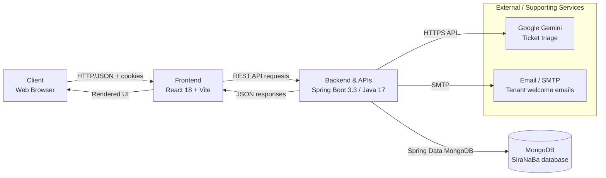
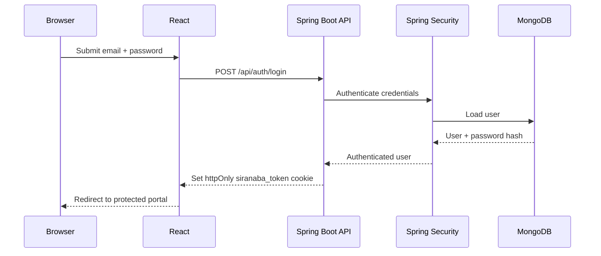
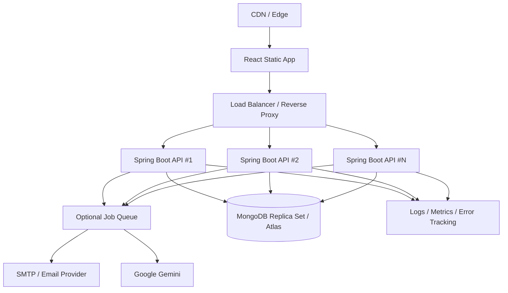

# ARCHITECTURE.md

# SiraNaBa Facility Portal — Architecture

> **Big picture. Clear structure. Scalable.**

High-level overview of the SiraNaBa Facility Portal, showing how the React tenant/admin interfaces communicate with the Spring Boot API, MongoDB persistence layer, authentication/security services, email delivery, and Google Gemini ticket-triage integration.

This document describes the architecture reflected in the current project source, including the parts that are already backed by the real API and the admin areas that still use local mock data.

---

## 01 System Overview

The application is a client/server web system with a React + Vite frontend and a Java 17 + Spring Boot backend. The backend is the source of truth for tenant, authentication, billing, ticket, notification, and staff data that has already been migrated to MongoDB.



### Core runtime responsibilities

| Layer | Responsibility | Current implementation |
|---|---|---|
| Client | User interaction, routing, rendering, forms | React 18, React Router |
| Frontend | UI composition, API calls, session state | Vite, Tailwind CSS, `src/api/*` |
| Backend | Authentication, authorization, business rules, REST endpoints | Spring Boot 3.3.4, Java 17 |
| Persistence | Durable application data | MongoDB via Spring Data MongoDB |
| Authentication | Login, JWT issuance, protected API access | Spring Security + JWT in `httpOnly` cookie |
| AI triage | Ticket severity, safety note, estimated completion time | Google Gemini, with keyword fallback |
| Email | Tenant welcome/login emails | Spring Boot Mail + SMTP |
| Admin mock layer | Remaining prototype-only admin screens | `src/data/adminMockDb.js` |

### External integrations

- **Authentication** — Spring Security validates authenticated API requests; JWTs are stored in the `siranaba_token` `httpOnly` cookie.
- **Database** — MongoDB stores tenants, users, tickets, billing, notifications, staff, audit logs, and related documents.
- **AI** — `GeminiTriageService` calls Google Gemini when `GEMINI_API_KEY` is configured.
- **Email** — `EmailService` uses SMTP for tenant welcome emails. If `MAIL_HOST` is empty, registration still succeeds without sending email.
- **Payments** — the current tenant payment flow is implemented as a demo checkout in the backend rather than a live Stripe/PayPal gateway integration.
- **Inventory / IoT** — no external inventory or IoT provider is currently represented as a production backend integration; corresponding admin UI functionality remains part of the prototype/mock layer.

---

## 02 Tech Stack

The project is intentionally split into a lightweight browser application and a conventional REST API.

| Category | Technologies | Role |
|---|---|---|
| **Frontend** | React 18.3, React Router 6, Vite 5 | SPA rendering, routing, application shell |
| **Styling** | Tailwind CSS 3, PostCSS, Autoprefixer | Responsive UI and utility styling |
| **Frontend utilities** | `clsx`, `tailwind-merge` | Conditional and conflict-free class composition |
| **Backend** | Java 17, Spring Boot 3.3.4 | REST API and application runtime |
| **API** | Spring Web | HTTP controllers and JSON responses |
| **Database** | MongoDB, Spring Data MongoDB | Document persistence and repositories |
| **Security** | Spring Security, JJWT 0.12.6, BCrypt | Authentication, authorization, JWT handling |
| **Validation** | Spring Boot Validation | Request validation |
| **Email** | Spring Boot Mail / SMTP | Tenant registration emails |
| **AI** | Google Gemini (`gemini-2.0-flash` by default) | Maintenance-ticket triage |
| **Build tools** | npm, Maven | Frontend/backend dependency and build management |
| **Development orchestration** | `concurrently` | Runs Vite and Spring Boot together with `npm run dev:all` |
| **Configuration** | `.env`, `application.yml`, Vite env variables | Runtime configuration and deployment overrides |

### Frontend architecture

The frontend follows a component/page/context pattern:

```text
src/
├── api/                 # Central HTTP client + endpoint definitions
├── components/          # Reusable UI components
│   ├── admin/           # Admin-specific layout and controls
│   ├── billing/         # Billing-specific UI
│   └── nav/             # Navigation components
├── context/             # Shared session/tenant state
├── data/                # Prototype/admin mock data still in use
├── pages/               # Tenant and admin screens
├── utils/               # Formatting, class helpers, auto-refresh
├── App.jsx              # Application routing/auth guard
├── index.css            # Global styles
└── main.jsx             # React entry point
```

All normal frontend API traffic funnels through `src/api/client.js`. It uses `fetch`, includes credentials, and defaults to `http://localhost:8080`; production deployments can override this through `VITE_API_BASE_URL`.

### Backend architecture

The Spring Boot application uses a conventional layered structure:

```text
server/src/main/java/com/siranaba/backend/
├── bootstrap/            # Demo-data initialization
├── config/               # Application, CORS, and security configuration
├── controller/           # REST API boundary
├── dto/                  # Request/response contracts
├── exception/            # API exceptions and global error handling
├── model/                # MongoDB document models
├── repository/           # Spring Data MongoDB repositories
├── security/             # JWT, cookie, authentication helpers
└── service/              # Business logic and integrations
```

This keeps HTTP concerns in controllers, persistence access in repositories, business rules in services, and MongoDB document definitions in models.

---

## 03 Project Structure

The following tree represents the important source files and directories rather than generated dependencies such as `node_modules`, Maven build output, or `package-lock.json`.

```text
SiraNaBa/
├── index.html                         # Vite HTML entry point
├── package.json                       # Frontend scripts and dependencies
├── vite.config.js                     # Vite configuration
├── tailwind.config.js                 # Tailwind configuration
├── postcss.config.js                  # PostCSS configuration
├── src/
│   ├── main.jsx                       # React application bootstrap
│   ├── App.jsx                        # Routes + authentication guard
│   ├── index.css                      # Global Tailwind/application styles
│   │
│   ├── api/
│   │   ├── client.js                  # Central fetch wrapper
│   │   └── endpoints.js               # Frontend API endpoint map
│   │
│   ├── context/
│   │   ├── SessionContext.jsx         # Authenticated tenant/session state
│   │   └── TenantRegistryContext.jsx  # Tenant registry UI state
│   │
│   ├── components/
│   │   ├── AppShell.jsx               # Shared application shell
│   │   ├── Layout.jsx                 # Main layout
│   │   ├── Sidebar.jsx                # Tenant navigation
│   │   ├── Topbar.jsx                 # Tenant top navigation
│   │   ├── Modal.jsx                  # Reusable modal/dialog
│   │   ├── Card.jsx                   # Shared card surface
│   │   ├── DataTable.jsx              # Generic data table
│   │   ├── StatusBadge.jsx            # Status/priority presentation
│   │   ├── Icon.jsx                   # Shared icon rendering
│   │   ├── admin/                     # Admin shell and admin widgets
│   │   ├── billing/                   # Billing components
│   │   └── nav/                       # Page/side navigation
│   │
│   ├── pages/
│   │   ├── Dashboard.jsx              # Tenant dashboard
│   │   ├── Maintenance.jsx            # Ticket list/tracking
│   │   ├── SubmitRequest.jsx          # Maintenance request workflow
│   │   ├── TicketDetail.jsx           # Ticket details
│   │   ├── Billing.jsx                # Billing/payment center
│   │   ├── Notifications.jsx          # Notification center
│   │   ├── Settings.jsx               # Account settings
│   │   ├── Login.jsx                  # Tenant login
│   │   ├── AdminLogin.jsx             # Admin login
│   │   └── admin/                     # Admin portal screens
│   │
│   ├── data/
│   │   ├── adminMockDb.js             # Mock data for remaining admin prototypes
│   │   └── buildingData.js             # Building/map UI data
│   │
│   └── utils/
│       ├── cn.js                      # Tailwind class composition
│       ├── format.js                  # Currency/date formatting
│       └── useAutoRefresh.js          # Periodic/focus refresh behavior
│
└── server/
    ├── pom.xml                        # Maven/Spring Boot dependencies
    ├── .env.example                   # Backend configuration template
    ├── src/main/resources/
    │   └── application.yml            # Spring configuration
    │
    └── src/main/java/com/siranaba/backend/
        ├── BackendApplication.java    # Spring Boot entry point
        ├── bootstrap/
        │   └── DataSeeder.java        # First-run demo data
        ├── config/
        │   ├── AppProperties.java
        │   ├── CorsConfig.java
        │   └── SecurityConfig.java
        ├── security/
        │   ├── JwtService.java
        │   ├── JwtAuthenticationFilter.java
        │   ├── CookieUtil.java
        │   └── JsonAuthenticationEntryPoint.java
        ├── controller/                # REST endpoints
        ├── dto/                       # API contracts
        ├── model/                     # MongoDB documents
        ├── repository/                # MongoDB repositories
        ├── service/                   # Business/integration logic
        └── exception/                 # API error handling
```

### Backend domain model

The current backend contains document models for:

- `User` — login identity and tenant/admin association.
- `Tenant` — tenant profile, unit and lease information.
- `Billing` — balance, utility charges, transactions and payment state.
- `UtilityUsage` — metered water/electricity usage used in billing.
- `Ticket` — maintenance requests and lifecycle state.
- `Staff` / `Specialist` — maintenance workforce information.
- `NotificationDoc` — tenant/admin notifications.
- `AuditLog` — administrative activity records.
- `Attachment` — ticket-related attachments.
- `TimelineEvent` / `ActivityItem` — activity and ticket history.
- `ScheduledMaintenance` — scheduled maintenance information.
- `ManagementTool` / `Cta` — supporting domain/UI data.

### Important architectural boundary

The project is **partially migrated from mock data to the real backend**.

Already connected to MongoDB/API include the tenant portal's core tenant, authentication, dashboard, tickets, billing, notifications, and the admin tenant/staff/payment/system areas represented in `src/api/endpoints.js`.

The following admin areas are explicitly documented as still using `src/data/adminMockDb.js`:

- Command Center
- Triage/Dispatch prototype views
- Configuration prototype data outside the live database-status endpoint
- IoT Emergency

These should be treated as prototype boundaries when extending the architecture.

---

## 04 Data Flow

A representative maintenance-request flow illustrates how data moves through the application.

### 1. User action

A tenant opens **Submit Maintenance Request** in the React application and completes the request form.

```text
Browser
  │
  │ form submission
  ▼
SubmitRequest.jsx
```

### 2. Frontend API request

The page calls `endpoints.createTicket(payload)`, which routes through the centralized `api` client.

```text
SubmitRequest.jsx
      │
      ▼
api/endpoints.js
      │
      ▼
api/client.js
      │
      │ POST /api/tickets
      ▼
Spring Boot API :8080
```

The frontend uses `credentials: 'include'`, allowing the authentication cookie to accompany the request.

### 3. Authentication and authorization

Spring Security processes the request. The JWT authentication filter reads the `siranaba_token` cookie, validates the token, and establishes the authenticated user context.

```text
HTTP request
   │
   ▼
JwtAuthenticationFilter
   │
   ├── invalid/missing session ──► 401 JSON response
   │
   └── valid JWT
          │
          ▼
     Controller
```

### 4. Business processing and AI triage

`TicketController` delegates ticket creation to the service layer. The backend can invoke `GeminiTriageService` to determine:

- Severity/priority
- Safety note
- Estimated completion time

If `GEMINI_API_KEY` is unavailable, the service falls back to keyword-based rules so ticket creation remains usable during development/demo environments.

```text
TicketController
      │
      ▼
TicketService
      │
      ├──────────────► GeminiTriageService ──► Google Gemini
      │                        │
      │                        └── keyword fallback when unavailable
      │
      ▼
Ticket model
```

### 5. Persistence

The service uses a Spring Data MongoDB repository to persist the ticket and related state.

```text
Service
  │
  ▼
TicketRepository
  │
  ▼
MongoDB
  └── tickets collection
```

### 6. Response and UI refresh

The backend returns a JSON representation of the created ticket. React updates the current UI, and subsequent dashboard/maintenance requests read the persisted state from MongoDB.

```text
MongoDB
   │
   ▼
Repository → Service → Controller
   │
   ▼
JSON response
   │
   ▼
api/client.js
   │
   ▼
React state/UI
```

### Authentication flow



### Billing flow

For the current admin-issued monthly bill:

```text
Admin selects tenant
        │
        ▼
Admin tenant billing UI
        │
        │ POST /api/admin/tenants/{id}/bills
        ▼
AdminTenantController
        │
        ▼
AdminTenantService / BillingService
        │
        ├── base rent
        ├── water usage
        ├── electricity usage
        └── parking fee (when applicable)
        │
        ▼
MongoDB billing document
        │
        ▼
Tenant Billing page reads /api/billing
```

The tenant payment action currently uses the backend's demo checkout/payment flow and records the resulting transaction/reference information.

---

## 05 Scalability & Future Considerations

The current monolithic Spring Boot API + MongoDB architecture is appropriate for the present application scope. The following areas provide a practical path for growth without requiring an immediate rewrite.

- **Containerization**
  - Package the React build and Spring Boot API into reproducible deployment units.
  - Use Docker for local parity and predictable production builds.
  - Introduce a container orchestrator only when operational scale requires it.

- **Database replication**
  - Use MongoDB Atlas or a production replica set for high availability.
  - Configure automated backups, point-in-time recovery, and tested restore procedures.
  - Add appropriate indexes as ticket, billing, tenant, and audit collections grow.

- **CDN and edge delivery**
  - Serve the compiled Vite frontend and static assets through a CDN.
  - Cache immutable assets with content-hashed filenames.
  - Keep API traffic separate from static asset delivery.

- **Horizontal API scaling**
  - Keep Spring Boot instances stateless apart from the signed authentication cookie.
  - Run multiple API instances behind a reverse proxy/load balancer.
  - Externalize all secrets and environment-specific configuration.

- **Background job processing**
  - Move slow/non-critical work such as email delivery and AI triage to asynchronous jobs when request volume increases.
  - Consider a queue for ticket processing, notifications, and scheduled maintenance tasks.

- **AI reliability**
  - Add explicit timeouts, retry policies, rate-limit handling, and structured validation around Gemini responses.
  - Persist the triage result and model/version metadata for auditability.
  - Retain the deterministic fallback for degraded/offline operation.

- **Observability**
  - Add structured application logs, request IDs, metrics, health checks, and centralized error tracking.
  - Monitor API latency, MongoDB latency, failed authentication, email delivery, and AI-call failures.

- **Security hardening**
  - Rotate JWT signing secrets through a secure secret manager.
  - Enforce HTTPS in production.
  - Configure secure cookie attributes and an appropriate SameSite policy for the deployed domain.
  - Add rate limiting and login-abuse protection.
  - Keep `.env` files and credentials outside source control.

- **Admin migration**
  - Replace `adminMockDb.js` functionality with real REST endpoints so every admin screen uses the same MongoDB source of truth.
  - Continue the existing pattern used by Tenant Management and Staff Management.

- **Payment integration**
  - Replace the current demo checkout with a real payment provider when production payments are required.
  - Verify payment webhooks server-side and make transaction handling idempotent.

- **File and attachment storage**
  - Move uploaded ticket attachments to object storage rather than storing large binary content directly in application documents.
  - Store only object keys/metadata in MongoDB.

- **Multi-tenant growth**
  - Continue enforcing tenant ownership at the service/repository boundary.
  - Introduce stronger tenant-scoped authorization rules as the number of buildings/properties grows.
  - Consider property/building entities above the current tenant/unit model.

- **API evolution**
  - Version public APIs when breaking changes become necessary.
  - Keep DTOs as the stable contract between React and Spring Boot.
  - Add automated API/integration tests before major schema or endpoint changes.

### Recommended target architecture



---

## Current architecture at a glance

```text
┌─────────────────────────────────────────────────────────────────────┐
│                         SiraNaBa Portal                            │
├─────────────────────────────────────────────────────────────────────┤
│ React 18 + Vite + Tailwind                                         │
│ ├── Tenant Portal                                                  │
│ ├── Admin Portal                                                   │
│ ├── React Router                                                   │
│ └── Central API Client                                             │
└──────────────────────────────┬──────────────────────────────────────┘
                               │ REST / JSON
                               │ httpOnly JWT cookie
                               ▼
┌─────────────────────────────────────────────────────────────────────┐
│                    Spring Boot 3.3 / Java 17                       │
│ ├── Controllers                                                    │
│ ├── DTOs                                                           │
│ ├── Services                                                       │
│ ├── Spring Security + JWT                                         │
│ ├── Validation + Exception Handling                               │
│ └── Integration Services                                          │
└──────────────┬──────────────────────┬───────────────────┬──────────┘
               │                      │                   │
               ▼                      ▼                   ▼
        ┌────────────┐        ┌──────────────┐    ┌──────────────┐
        │  MongoDB   │        │ Google Gemini│    │ SMTP / Email │
        │ persistence│        │ AI triage    │    │ delivery     │
        └────────────┘        └──────────────┘    └──────────────┘
```

> **Architecture status:** The core tenant-facing workflow is backed by the real Spring Boot + MongoDB stack. Some admin functionality remains intentionally prototype-backed by `src/data/adminMockDb.js` and should be migrated before treating the entire admin portal as production-persistent.
